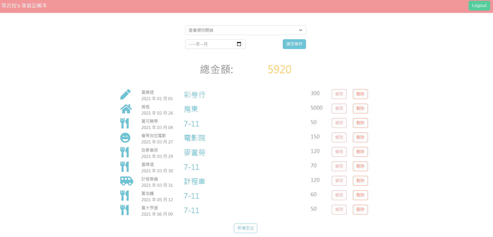

# 首頁

* 使用者可以在首頁看到:
  * 支出名稱
  * 支出日期
  * 支出商家
  * 分類
  * 金額、總金額
* 使用者可以用年月和分類來進行篩選
* 使用者可以註冊帳號
* 使用者也可以透過 Facebook Login 直接登入

# 環境建置
* bcryptjs: 2.4.3
* body-parser: 1.19.0
* connect-flash: 0.1.1
* dayjs: 1.10.6
* dotenv: 10.0.0
* express: 4.17.1
* express-handlebars: 5.3.2
* express-session: 1.17.2
* method-override: 3.0.0
* mongoose: 5.13.3
* passport: 0.4.1
* passport-facebook: 3.0.0
* passport-local: 1.0.0

# CRUD功能
* Create: 使用者可以點擊右上角和下方的的新增支出，即可新增支出
* Read: 使用者可以在首頁依分類閱覽支出列表
* Update: 使用者點可以修改支出項目
* Delete: 使用者可以刪除支出項目

# 使用方法

1. 終端機輸入指令 `git clone https://github.com/godzillalogan/expenseTracker.git`
2. 進入專案 `cd exprenseTracker`
3. 安裝相關套件 `npm install`
4. 新增種子資料 `npm run seed`
5. 開啟專案 `npm run dev`
5. 出現以下訊息就可以在localhost:3000開啟本專案`App is running on http://localhost:3000`

